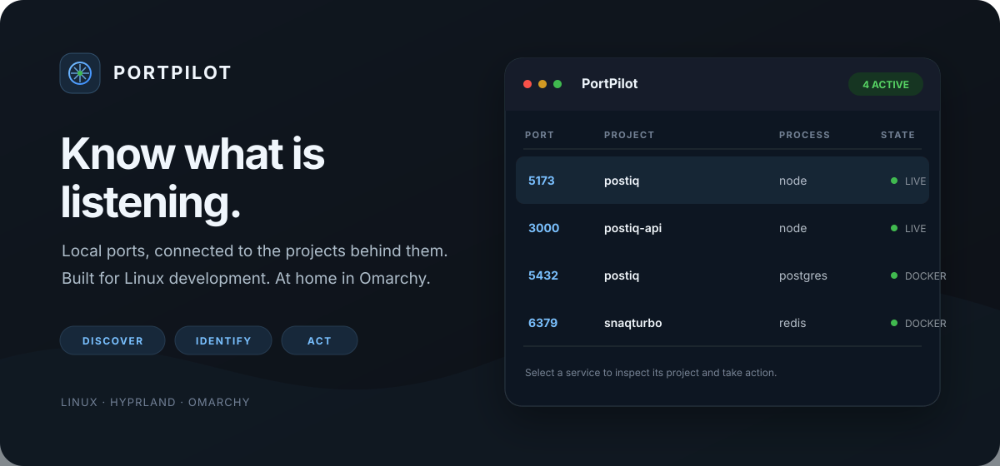
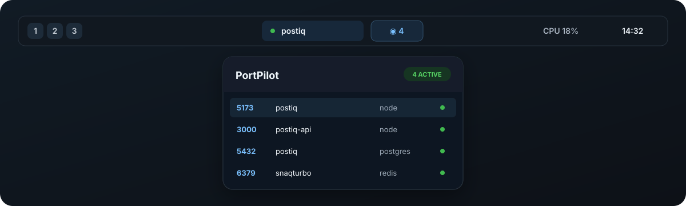
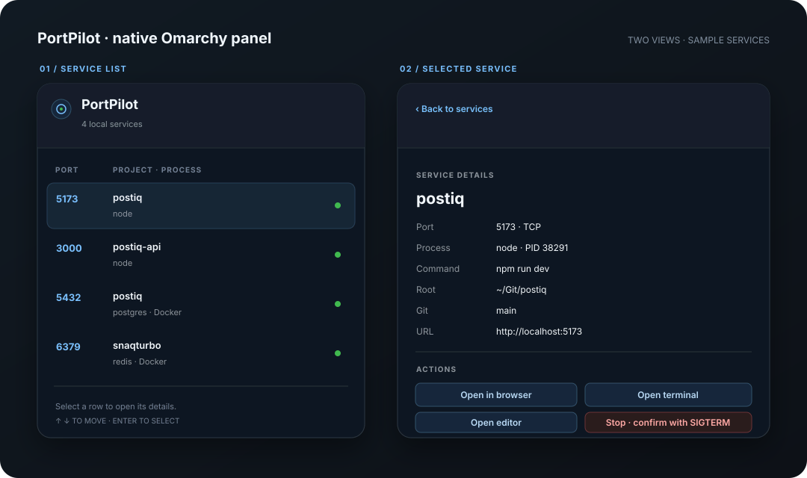
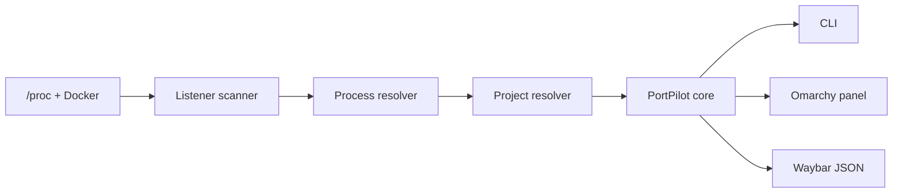

<p align="center">
  
</p>

<p align="center">
  <a href="https://github.com/kauanmassuia14/omaports/blob/main/LICENSE"></a>
  
  
  
</p>

<p align="center"><strong>Your local development ports, under control.</strong><br>
Discover · Identify · Open · Inspect · Stop<br>
Linux · Hyprland · Omarchy</p>

PortPilot shows which local services are listening, which process owns them, and which project they belong to. It combines a small Rust CLI with a native Omarchy shell widget and panel. Docker is optional; normal process discovery works without elevated privileges.

## Demo

```text
$ portpilot list

PORT    PROJECT                PROCESS            PID        TYPE
5173    postiq                 node               38291      process
3000    postiq-api             node               38401      process
5432    postiq                 postgres           —          docker
6379    snaqturbo              redis              —          docker
```

<p align="center">
  
</p>

The visuals above are hand-built interface previews. Port numbers and project names are sample data; PortPilot discovers the values on the current machine.

## Why PortPilot?

Local development stacks accumulate quickly. A browser, API, database, and queue can each own a port, while tools such as `ss` and `lsof` only show the socket or process. PortPilot connects those details to a project root so the next step is close at hand.

## Features

- Scans Linux TCP `LISTEN` sockets from `/proc/net/tcp` and `/proc/net/tcp6`.
- Resolves socket inodes to processes through `/proc/<pid>/fd`; reads command line, working directory, user, and parent process chain when permissions allow.
- Finds project roots through Git metadata, project manifests, command paths, and parent-process working directories.
- Recognizes `package.json`, `pyproject.toml`, `Cargo.toml`, `go.mod`, and Docker Compose files.
- Adds optional Docker container, published-port, image, Compose label, service, and host working-directory details through the Docker CLI.
- Includes a native Omarchy bar widget and Quickshell panel, plus a Waybar JSON adapter.
- Opens detected HTTP services, project terminals, or editors; stops services with confirmation and a graceful signal first.
- Keeps the default list and panel focused on development-classified services. `list --all` includes development, unknown, system, and configured ignored ports; Waybar counts development services only.

## Omarchy integration

PortPilot is a third-party Omarchy shell plugin. The bar module shows the current development-service count. Clicking it opens a native panel with project details and supported actions. The panel uses the current Omarchy theme and does not modify your `shell.json` automatically.

<p align="center">
  
</p>

### Interactive panel

Click a service to inspect its project and process. Use the action picker to open a detected web service, start a terminal or editor in the project root, or stop the process/container after confirming. The list supports mouse selection and arrow/Enter navigation. Process logs, restart, and clipboard actions are not part of this release.

### Install on Arch / Omarchy / Hyprland

Install the CLI, then add and enable the shell plugin:

```bash
cargo install --git https://github.com/kauanmassuia14/omaports --locked
omarchy plugin add https://github.com/kauanmassuia14/omaports --enable --yes
omarchy bar move io.github.kauanmassuia14.portpilot --section right
```

The plugin needs the `portpilot` executable in the shell's `PATH`. If you install it somewhere else, set the bar widget's **PortPilot executable** setting to its absolute path. To remove the integration later, use `omarchy plugin remove io.github.kauanmassuia14.portpilot`.

For local development from a checkout:

```bash
./scripts/dev-install.sh
omarchy-shell shell rescanPlugins
omarchy plugin enable io.github.kauanmassuia14.portpilot
```

The development script copies only the plugin sources into `~/.config/omarchy/plugins/` and installs the CLI. It does not edit or enable a bar layout. Omarchy plugins run as code inside the shell process; review the QML source before enabling it.

## Waybar

`portpilot waybar` prints one JSON object to stdout and caches the scan briefly. Add the custom module to your Waybar configuration:

```jsonc
"custom/portpilot": {
  "exec": "portpilot waybar",
  "return-type": "json",
  "interval": 3,
  "on-click": "portpilot ui",
  "tooltip": true
}
```

Add `custom/portpilot` to a Waybar module list, for example `modules-right`. When the Omarchy plugin is enabled, `portpilot ui` asks the running shell to open its panel. Otherwise, it selects a menu provider (`fuzzel`, `rofi`, `wofi`) or a terminal prompt.

Example output:

```json
{"text":"󰖟 2","tooltip":"2 local development services\n3000  postiq-api\n5173  postiq","class":"active"}
```

The idle state is `{"text":"󰖟 0","tooltip":"No local development services","class":"idle"}`. Set `waybar.icon` in the PortPilot config to change the glyph.

## Project detection

For each listener, PortPilot maps the socket inode to a readable process file descriptor. It inspects the process working directory and up to eight parents, then looks for a Git root and project manifests. Manifest names improve the display name; a Git root supplies the project path and current branch. When the process is hidden by Linux permissions, the service remains visible with the details PortPilot could read.

Docker support is optional. PortPilot checks running containers and their published ports, then reads Compose labels such as `com.docker.compose.project`, `com.docker.compose.service`, and `com.docker.compose.project.working_dir`. Docker commands have a short timeout. If the CLI, daemon, or socket is unavailable, container metadata is skipped and regular `/proc` scanning continues.



## Architecture

The Rust core keeps Linux discovery and project resolution independent from its presentation adapters. The Omarchy plugin and Waybar module each request the service data they need; the UI layer does not implement another scanner.

## Install from a checkout

Requirements: Linux, Rust 1.85 or newer, and a C toolchain supported by Rust. Docker is optional. `cargo install --path .` builds and installs the CLI to Cargo's binary directory.

```bash
git clone https://github.com/kauanmassuia14/omaports.git
cd omaports
cargo install --path .
```

For a local build without installing:

```bash
cargo run -- list
```

## Configuration

PortPilot works without a config file. To customize it, copy the sample:

```bash
mkdir -p "${XDG_CONFIG_HOME:-$HOME/.config}/portpilot"
cp config.example.toml "${XDG_CONFIG_HOME:-$HOME/.config}/portpilot/config.toml"
```

```toml
refresh_interval = 3

[projects]
search_git_root = true

[ui]
provider = "auto" # auto, omarchy, fuzzel, rofi, wofi, terminal

[actions]
terminal = "kitty"
editor = "nvim"

[ports]
ignore = [53, 631]

[waybar]
icon = "󰖟"
```

`refresh_interval` controls the Waybar cache lifetime in seconds (bounded to 1–60). The Omarchy widget has a separate refresh setting in the bar widget configuration. `ports.ignore` hides ports from the normal list, Waybar, and interactive panel; `portpilot list --all` shows them. The default config ignores no ports.

Terminal editors such as `nvim`, `vim`, `hx`, and `nano` open inside the configured terminal. GUI editors are launched directly with the project root as an argument.

## Commands

| Command | What it does |
| --- | --- |
| `portpilot` / `portpilot list` | List services classified as development |
| `portpilot list --all` | Include unknown, system, and configured ignored ports |
| `portpilot list --json` | Print service records as JSON |
| `portpilot inspect 5173` | Show process, project, Git, URL, or Docker details |
| `portpilot project 5173` | Print the detected project root |
| `portpilot open 5173` | Open a port recognized as HTTP in the default browser |
| `portpilot terminal 5173` | Open a terminal in the project root |
| `portpilot edit 5173` | Open the project in the configured editor |
| `portpilot kill 5173` | Ask before sending `SIGTERM` or gracefully stopping its container |
| `portpilot kill 5173 --force` | Ask before using `SIGKILL` or `docker kill` |
| `portpilot ui` | Open the Omarchy panel or an available menu fallback |
| `portpilot waybar` | Print Waybar-compatible JSON |

`open` only acts on services that PortPilot identifies as likely HTTP (common web ports or recognizable server commands). Other ports remain inspectable. No HTTP request is made as a probe.

## Safety and limitations

- Port discovery does not require `sudo`; inaccessible process metadata is treated as unavailable.
- Process termination asks for confirmation. `SIGTERM` is the default; `--force` is explicit.
- Before signaling a process, PortPilot checks the service again and pins the PID with Linux `pidfd` support. If that support is unavailable or the listener changed, it refuses the signal.
- Process signals are limited to the current unprivileged user. Root-owned, other-user, and known critical system processes are protected. PortPilot does not kill Docker's daemon PID; Docker services are stopped through the container API.
- Non-interactive `kill` requires `--yes` after the caller has reviewed the target.
- Project detection is heuristic. Processes with unrelated or inaccessible working directories may have an unknown project.
- The v1 panel does not claim live logs, automatic restarts, clipboard actions, or service health checks.

## Development

```bash
cargo fmt --all -- --check
cargo clippy --all-targets -- -D warnings
cargo test
cargo build --release
```

The Rust tests cover `/proc` table parsing, project roots and manifests, parent process project lookup, Docker metadata, classification, configuration defaults, Waybar JSON, cache expiry, and kill safeguards.

## Roadmap

- Live log viewing and deliberate restart workflows.
- Copy URL/port actions and richer protocol detection.
- A small daemon with Unix-socket clients for larger setups.
- Service history and CPU/RAM summaries.

## Contributing

Issues and focused pull requests are welcome. Keep the core independent from Omarchy and Waybar adapters, avoid adding mandatory external services, and include a test for new parsing or safety behavior.

## License

PortPilot is released under the [MIT License](LICENSE).
